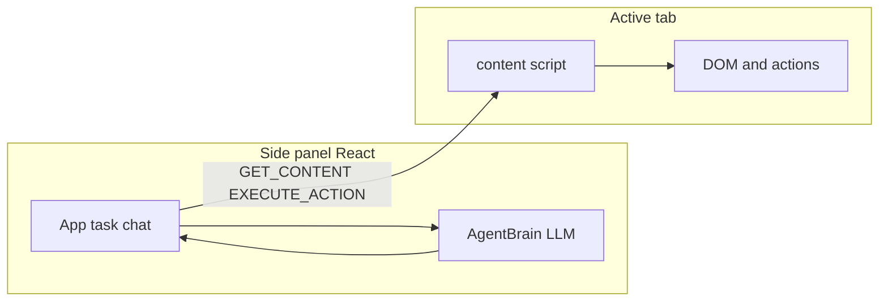

# Navai

**Navai** is a Chrome extension (Manifest V3) that runs a **side-panel “General Agent”** interface. You describe what to do on the web in natural language; a **planner LLM** (OpenAI-compatible API via LangChain) outputs structured **JSON actions**, and a **content script** on the active tab reads the DOM and performs clicks, typing, scrolling, navigation, file uploads, and more. The loop continues until the model returns `DONE` or `ASK`, you stop the agent, or built-in safety limits kick in.

The published name in the extension manifest is **General Agent Extension**; this repository is named **Navai**.

## Features

- **Natural-language tasks** with streaming model output in the chat UI.
- **Dual LLM configuration**: a **text model** chooses the next action; an optional **vision model** observes the visible tab (screenshot) and summarizes **attached images** for better grounding.
- **OpenAI-compatible backends**: local servers (e.g. Ollama at `http://localhost:11434/v1`), LM Studio, or cloud APIs—anything that exposes `/v1/chat/completions`-style endpoints and usually `/v1/models` for the **Fetch models** button.
- **Settings UI**: base URL, API key, and model for text and vision; optional manual model name entry.
- **No-auth local servers**: if the API key is empty, requests omit `Authorization` so local endpoints without keys work.
- **Prompt templates**: saved instructions prepended to your task; active template selectable in the UI.
- **Attachments**: text files and images add context (images go through the vision model when configured).
- **Upload assets**: files registered in Settings as **Assets**; reference them with `@` in the task (autocomplete) for `UPLOAD_ASSET` actions.
- **Persistence**: chat session (last 200 messages), templates, and settings are stored in extension `localStorage`.
- **Guards**: up to ~30 steps per run, detection of repeated actions on an unchanged page, and backoff on invalid JSON from the model.

## How it works



1. The side panel asks the **active tab’s** content script for a simplified page summary, element map (`data-agent-id` attributes), and viewport info.
2. Optionally it captures a **screenshot** of the visible tab and sends it to the **vision** model for a JSON-ish description of UI elements.
3. The **text** model streams a single JSON decision: `action` + `params`.
4. The content script **executes** that action and returns a string result; the history is fed into the next step.

## Requirements

- **Chromium-based browser** with **Side Panel** support (e.g. recent Chrome or Edge).
- **Node.js** 18+ recommended (project uses Vite 7).
- A running **OpenAI-compatible** HTTP API for the **text** model.
- Optionally, a **vision-capable** model on the same or another compatible endpoint for screenshots and image attachments.

## Build and install

```bash
npm install
npm run build
```

Load the extension from the **`dist/`** directory (not the repo root):

1. Open `chrome://extensions`.
2. Enable **Developer mode**.
3. **Load unpacked** and choose the **`dist`** folder.

Vite writes the side-panel UI, `content.js`, `background.js`, and copies `public/manifest.json` into `dist/` so paths match.

## First run

1. Pin or click the extension and open the **side panel**.
2. Open **Settings** and set the **text LLM** base URL and model (defaults target a local Ollama-style URL: `http://localhost:11434/v1`). Use **Fetch models** if your server lists models at `{baseUrl}/models`.
3. Optionally configure the **vision LLM** (same or different URL; e.g. a vision model name like `llava`).
4. Focus a **normal web page** tab (not restricted `chrome://` pages). If you see a connection error, **refresh** the page so the content script injects.
5. Enter a task and press **Go** (or use **STOP** while the agent runs).

## Configuration (`localStorage` keys)

| Key | Purpose |
|-----|--------|
| `agent_base_url` | Text LLM OpenAI-compatible base URL (e.g. `http://localhost:11434/v1`). |
| `agent_api_key` | Bearer token for the text API; may be empty for local no-auth servers. |
| `agent_model` | Text model id. |
| `agent_vision_base_url` | Vision LLM base URL. |
| `agent_vision_api_key` | Vision API key (optional). |
| `agent_vision_model` | Vision model id. |
| `agent_prompt_templates` | JSON array of saved templates. |
| `agent_active_template` | Id of the selected template, or empty. |
| `agent_session_messages` | JSON snapshot of the last 200 chat messages. |

Saving **Settings** persists the LLM and vision fields; templates and session update as you use the app.

## Supported actions (summary)

The agent must output JSON with `action` and `params`. Implemented actions include:

- **Terminal**: `DONE` (summary), `ASK` (question).
- **Navigation**: `NAVIGATE` (url).
- **Pointing**: `CLICK`, `CLICK_INDEX`, `CLICK_ID`, `CLICK_COORDS`; `HOVER`, `HOVER_ID`, `HOVER_COORDS`.
- **Input**: `TYPE`, `TYPE_ID`, `TYPE_COORDS`; `SELECT`, `SELECT_ID`; `KEY` (e.g. Enter).
- **View / time**: `SCROLL` (up/down), `WAIT` (ms).
- **Files**: `UPLOAD_ASSET` (uses assets from Settings by filename, with optional id/coords/label).

Exact parameter shapes are defined in the system prompt in `src/agent/brain.ts` and executed in `src/content.ts`.

## Extension permissions

Declared in `public/manifest.json`:

| Permission | Why |
|------------|-----|
| `sidePanel` | Show the React UI in the browser side panel. |
| `activeTab` | Operate on the user’s current tab when using the agent. |
| `scripting` | Inject or message the content script as needed. |
| `tabs` | Query the active tab, capture visible tab for screenshots. |
| `host_permissions`: `<all_urls>` | Content script can run on web pages you visit (subject to browser rules for restricted URLs). |

## Limitations

- Automation is **best-effort DOM scripting**; SPAs, shadow DOM, heavy anti-bot pages, or **cross-origin iframes** may not behave as expected.
- The agent only sees the **currently active tab** in the window you’re using.
- Quality and latency depend on your **models and hardware**.
- Invalid or non-JSON model output triggers retries with backoff; persistent failures stop the run with a message.

## Development

| Command | Description |
|---------|-------------|
| `npm run dev` | Vite dev server for iterating on the React UI (URL-based, not the packed extension). |
| `npm run build` | Typecheck + production bundle into `dist/` for loading as an unpacked extension. |
| `npm run preview` | Preview the production build via Vite’s preview server. |
| `npm run lint` | ESLint. |

For **full extension testing** (content script, background, `chrome.*` APIs), use **`npm run build`** and load **`dist/`** in Chrome.
